<div align="center">

<h1 align="center">music-website</h1>

<p align="center">
  <strong>Full-stack music website built with Vue 3 + Spring Boot · For learning and sharing</strong>
</p>

<br/>

<p align="center">
  <a href="https://github.com/Yin-Hongwei/music-website/stargazers"></a>
  <a href="https://github.com/Yin-Hongwei/music-website/network/members"></a>
  <a href="https://github.com/Yin-Hongwei/music-website/graphs/contributors"></a>
  <a href="https://github.com/Yin-Hongwei/music-website/issues"></a>
  <a href="https://github.com/Yin-Hongwei/music-website/pulls"></a>
  <a href="https://github.com/Yin-Hongwei/music-website/discussions"></a>
  <a href="https://github.com/Yin-Hongwei/music-website/blob/master/LICENSE"></a>
</p>

<p align="center">
  
  
  
  
  
  
  
  
  
</p>

<br/>

<p align="center">
  <a href="README.md">中文</a> · <strong>English</strong>
</p>

</div>

<h3 align="center"><font color="red">Notice</font></h3>

**I have always shared this project for technical learning purposes and do not charge for it (copyright belongs to me personally; you are welcome to use it for learning and sharing, but commercial use is not allowed). Please respect my work—thank you.**

<br/>

## About

The client and admin panels of this music website are built with **Vue**, the server uses **Spring Boot + MyBatis**, and the database is **MySQL**. For implementation details, see the **[blog post](https://yin-hongwei.github.io/2019/03/04/music/)**. For local setup, see [Quick Start](#quick-start) below.

<br/>

## Project Structure

```
music-website/
├── music-client/     # Public web client (Vue 3)
├── music-manage/     # Admin panel (Vue 3)
├── music-server/     # Backend API (Spring Boot)
│   └── data/         # Local media and logs (img / song / logs)
├── deploy/           # Docker Compose orchestration (images built from each app's Dockerfile)
├── sql/              # Database initialization scripts
└── docs/             # Documentation
```

<br/>

## Preview

<b>Client screenshots</b>
<table>
  <tr>
    <td width="50%" align="center">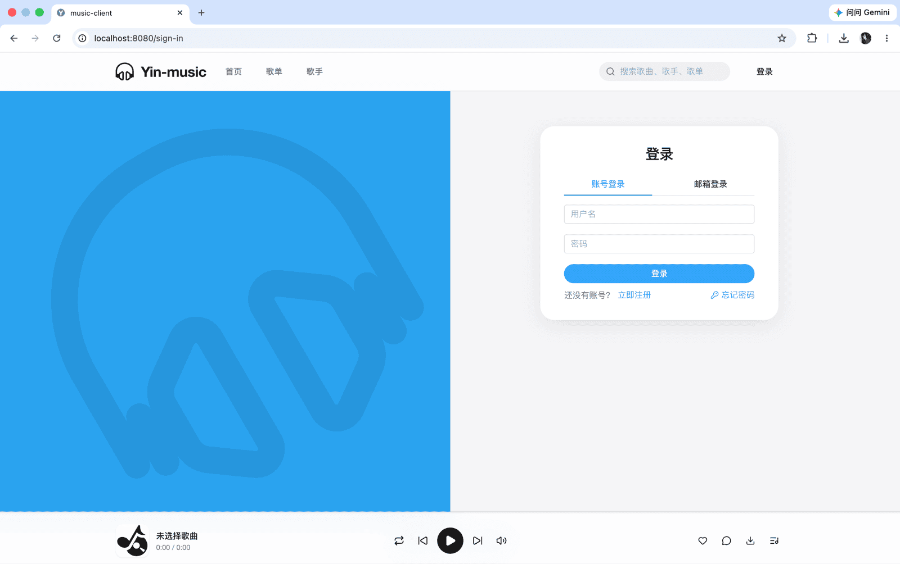</td>
    <td width="50%" align="center">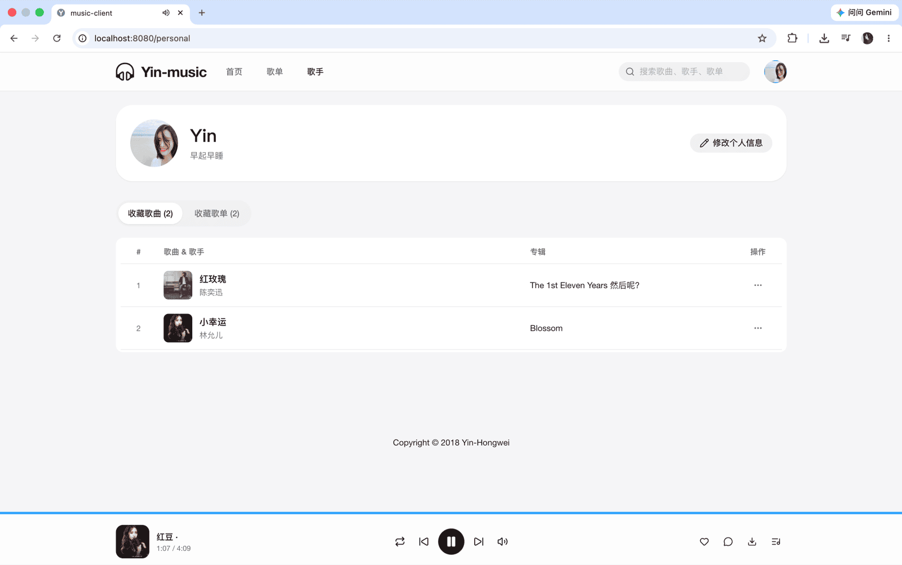</td>
  </tr>
  <tr>
    <td width="50%" align="center">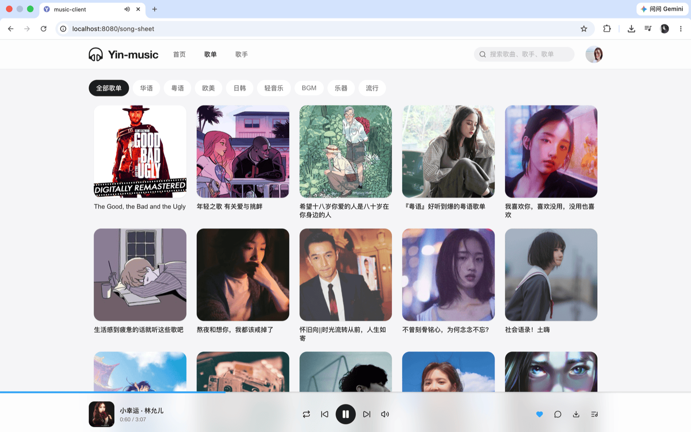</td>
    <td width="50%" align="center">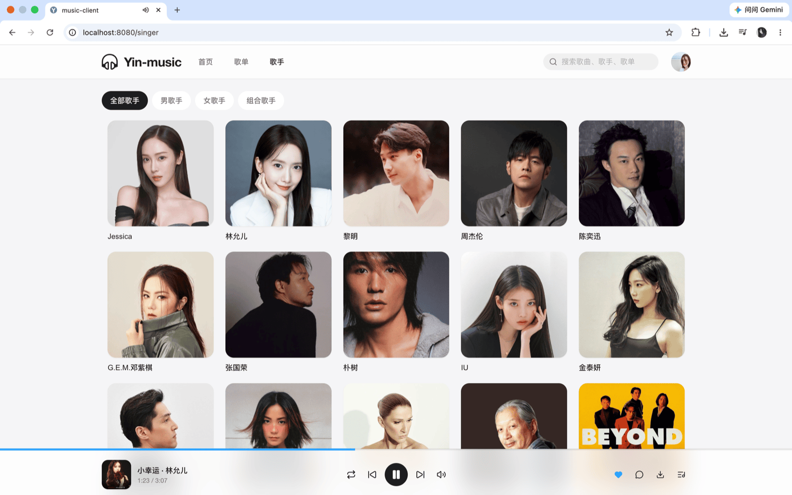</td>
  </tr>
  <tr>
    <td width="50%" align="center">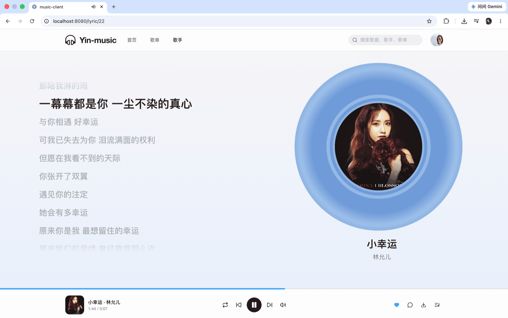</td>
    <td width="50%" align="center">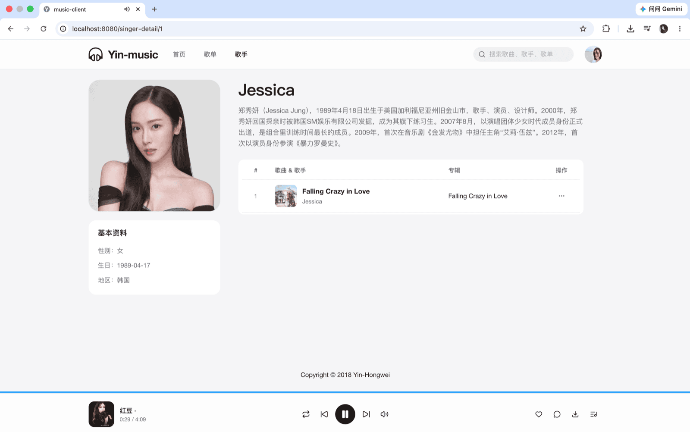</td>
  </tr>
</table>

<br/>
<b>Admin screenshots</b>
<table>
  <tr>
    <td width="50%" align="center">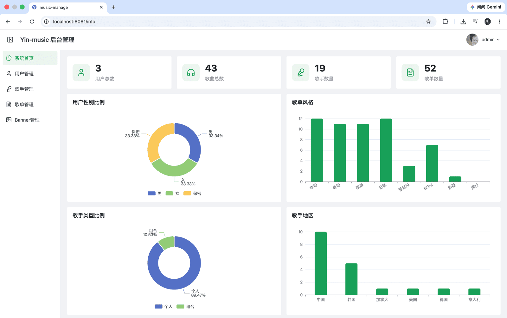</td>
    <td width="50%" align="center">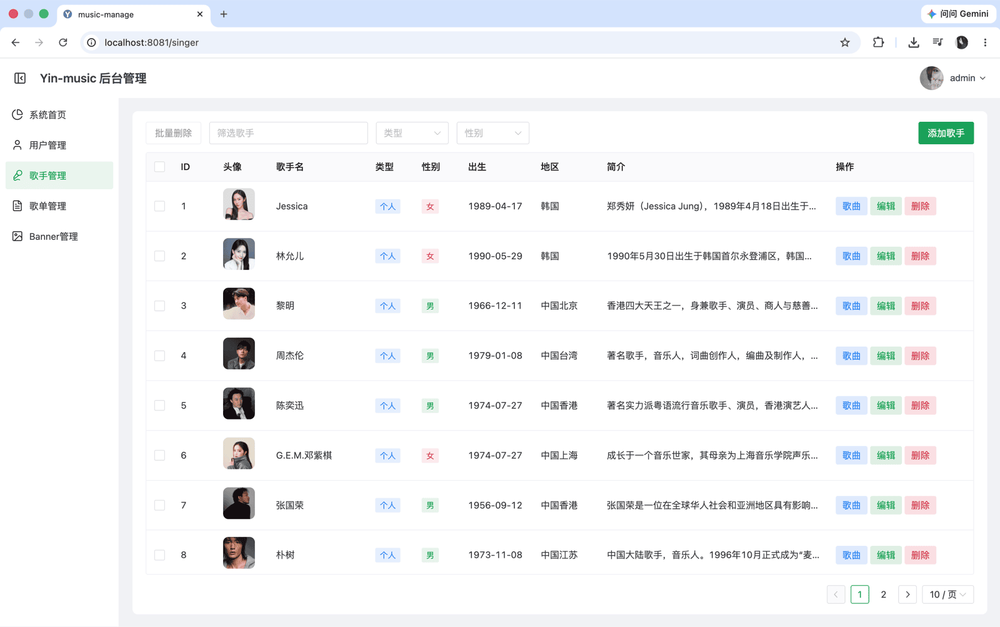</td>
  </tr>
  <tr>
    <td width="50%" align="center">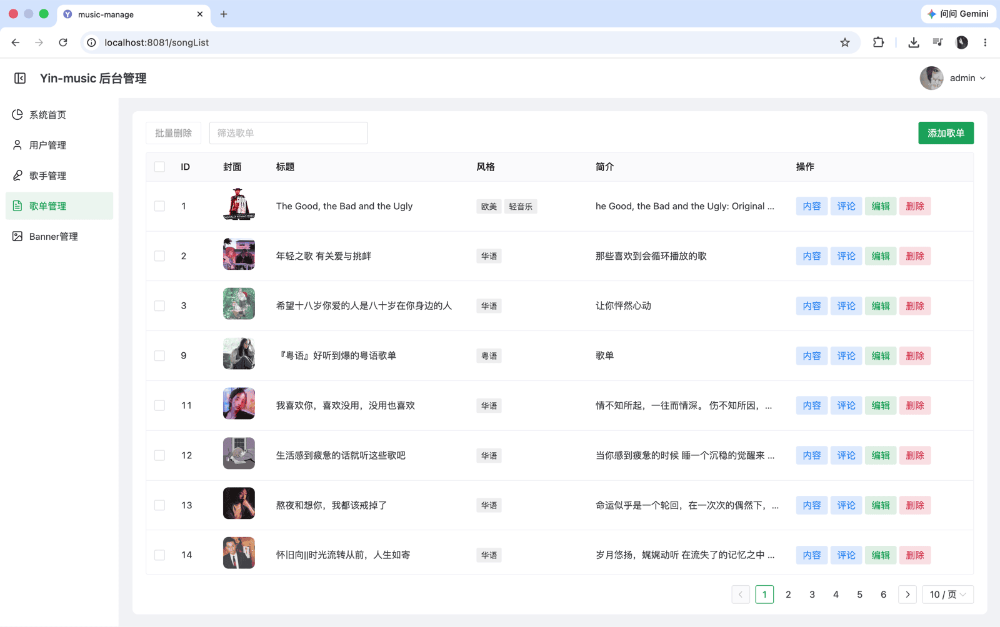</td>
    <td width="50%" align="center">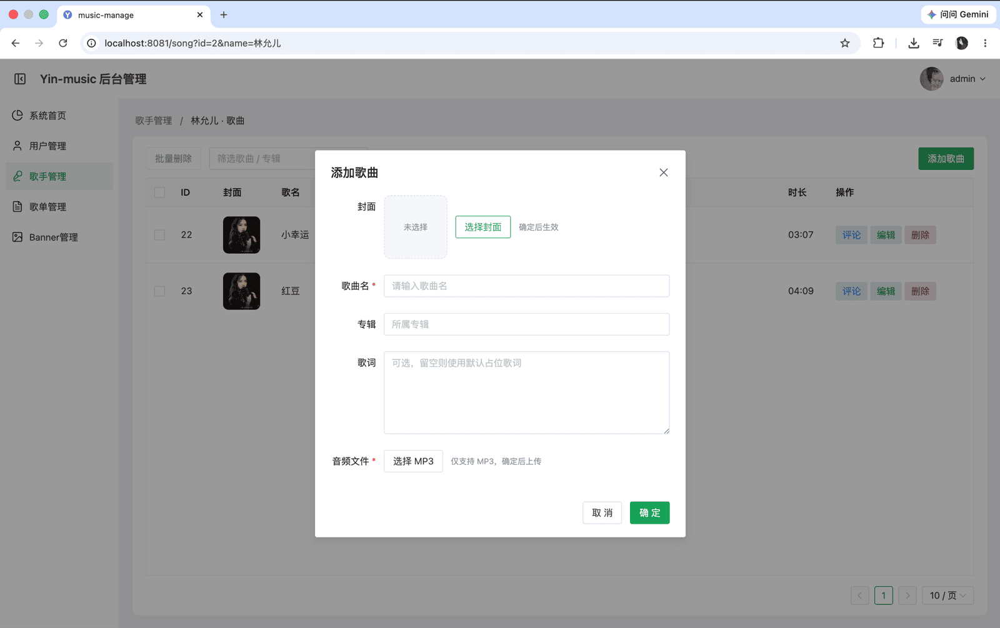</td>
  </tr>
</table>

<br/>

## Features

| Module        | Capabilities                                                                 |
| ------------- | ---------------------------------------------------------------------------- |
| **Users**     | Sign in / sign up, profile editing, personal center                          |
| **Discovery** | Song sheet recommendations, song sheets & singers, song/sheet search         |
| **Social**    | Comments on song sheets and songs, favorites                                 |
| **Player**    | Play, pause, seek, volume control, synced lyrics, download                   |
| **Admin**     | Banner, user, song, singer, song sheet, and comment management               |

<br/>

## Tech Stack

| Layer        | Technologies                                                                                          |
| ------------ | ----------------------------------------------------------------------------------------------------- |
| **Backend**  | Spring Boot · MyBatis · Redis · Local media storage (`music-server/data`)                             |
| **Frontend** | Vue 3 · TypeScript · Vue Router · Pinia · Axios · Element Plus (client) / Naive UI (admin)          |
| **Deploy**   | Docker · Docker Compose                                                                               |

<br/>

## Development Environment

| Tool    | Version                                                                                                |
| ------- | ------------------------------------------------------------------------------------------------------ |
| JDK     | 8+ (e.g. jdk-8u141)                                                                                    |
| MySQL   | 8.0+                                                                                                   |
| Redis   | 5.0.8+, or [run Redis with Docker](<https://nanshaws.github.io/docker/docker启动redis(完美过程).html>) |
| Node.js | 16+                                                                                                    |
| IDE     | IntelliJ IDEA / VS Code                                                                                |

<br/>

## Quick Start

### 1. Clone the repository

```bash
git clone git@github.com:Yin-Hongwei/music-website.git
cd music-website
```

### 2. Download media assets

Download songs and images:

- Link: https://pan.quark.cn/s/f64a22313775
- Extraction code: `21p9`

Place the `data` folder from the cloud drive under `music-server` so you have:

```
music-server/data/img/
music-server/data/song/
```

> **Note:** Keep the paths above. Local logs are written to `music-server/data/logs/` by default.

<p align="left">
  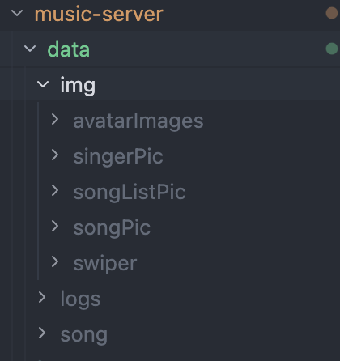
</p>

### 3. Configure the database

1. Create a database in MySQL and import `sql/yin_music.sql`
2. Edit `music-server/src/main/resources/application-dev.properties` and update `spring.datasource.username` and `spring.datasource.password` (the `dev` profile is active by default; see `application.properties`)

### 4. Start services

Start each service in the following order (you can use separate terminal windows):

| Service          | Directory      | Command                                                   |
| ---------------- | -------------- | --------------------------------------------------------- |
| **Backend API**  | `music-server` | `./mvnw clean spring-boot:run` (use `mvnw.cmd` on Windows) |
| **Redis**        | —              | `redis-server`                                            |
| **Web client**   | `music-client` | `npm install && npm run serve`                            |
| **Admin panel**  | `music-manage` | `npm install && npm run serve`                            |

<details>
<summary><b>Backend startup commands</b></summary>

```bash
# macOS / Linux (recommended — uses the project's Maven Wrapper)
./mvnw clean spring-boot:run

# Windows (recommended)
mvnw.cmd clean spring-boot:run

# Alternative: if Maven is installed locally
mvn clean spring-boot:run
```

</details>

<details>
<summary><b>Redis installation references</b></summary>

- Download: https://redis.io/
- Mac install example: https://www.jianshu.com/p/ce27d9ab4f8c

</details>

<br/>

## FAQ

| Symptom                      | Solution                                                                                                      |
| ---------------------------- | ------------------------------------------------------------------------------------------------------------- |
| Images or music fail to load | Ensure assets are in `music-server/data/img` and `music-server/data/song`, and start the backend from `music-server` |
| Music won't play             | Asset files may be corrupted—re-download from the cloud drive and replace them                                |

<br/>

## Docker Deployment

> You can skip this section for local development. It is intended for Linux server deployment.

Image definitions live in each app directory (`Dockerfile` under `music-server` / `music-client` / `music-manage`); `deploy/docker-compose.yml` handles orchestration only.

```bash
cd deploy
docker compose up --build
```

After startup:

| Service | URL                   |
| ------- | --------------------- |
| Client  | http://localhost:8080 |
| Admin   | http://localhost:8081 |
| API     | http://localhost:8888 |

Optional environment variables: `MYSQL_ROOT_PASSWORD`, `API_PUBLIC_URL` (backend URL baked into the frontend build at compile time; default `http://localhost:8888`).

<br/>

## Contributors

Thanks to everyone who has contributed code and improvements to this repository.

<a href="https://github.com/Yin-Hongwei/music-website/graphs/contributors">
  
</a>

<br/>

## Sponsorship

If this project has been helpful to you, feel free to buy me a coffee.


<br/>

## Contact

**1. Email: [yinhongwei96@126.com](mailto:yinhongwei96@126.com)**

**2. WeChat Official Account**


<br/>

## Git History

<a href="https://www.star-history.com/#Yin-Hongwei/music-website&Date">
  <picture>
    <source media="(prefers-color-scheme: dark)" srcset="https://api.star-history.com/svg?repos=Yin-Hongwei/music-website&type=Date&theme=dark" />
    <source media="(prefers-color-scheme: light)" srcset="https://api.star-history.com/svg?repos=Yin-Hongwei/music-website&type=Date" />
    
  </picture>
</a>

<br/>

## License

This project is licensed under the [Creative Commons Attribution-NonCommercial 4.0 International (CC BY-NC 4.0)](https://creativecommons.org/licenses/by-nc/4.0/) license. **Commercial use is not permitted.**

Copyright (c) 2018 Yin-Hongwei
