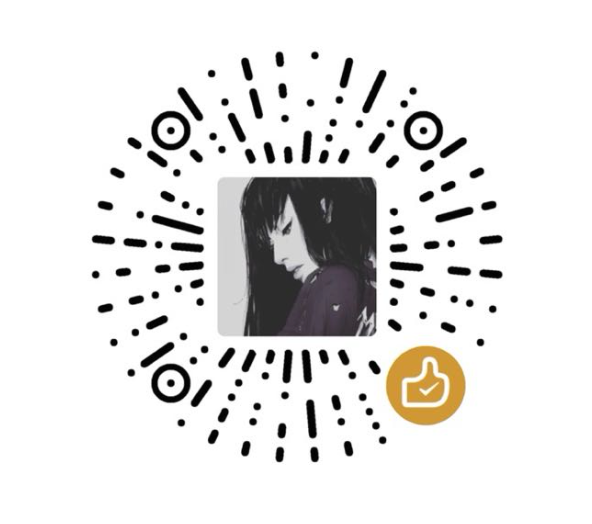

<div align="center">

<h1 align="center">music-website</h1>

<p align="center">
  <strong>Full-stack music website with Vue 3 + Spring Boot · For learning</strong>
</p>

<br/>

<p align="center">
  <a href="https://github.com/Yin-Hongwei/music-website/stargazers"></a>
  <a href="https://github.com/Yin-Hongwei/music-website/network/members"></a>
  <a href="https://github.com/Yin-Hongwei/music-website/graphs/contributors"></a>
  <a href="https://github.com/Yin-Hongwei/music-website/issues"></a>
  <a href="https://github.com/Yin-Hongwei/music-website/pulls"></a>
  <a href="https://github.com/Yin-Hongwei/music-website/discussions"></a>
  <a href="https://github.com/Yin-Hongwei/music-website/blob/master/LICENSE"></a>
</p>

<p align="center">
  
  
  
  
  
  
  
  
  
</p>

<br/>

<p align="center">
  <a href="README.md">中文</a> · <strong>English</strong>
</p>

</div>

<h3 align="center"><font color="red">Notice</font></h3>

**This project is shared for learning and technical discussion only (copyright remains with the author). You are welcome to use it for study and exchange; commercial use is not permitted. Please respect the work that went into it—thank you.**

<br/>


## Project overview

The public web client and admin console are built with **Vue**. The server uses **Spring Boot + MyBatis**, with **MySQL** as the database. For design notes, see **[Yuque (Chinese)](https://www.yuque.com/yinhongwei-ya0u7/bk3hhk/nu3i7emefxvetpz8)** or the **[blog post](https://yin-hongwei.github.io/2019/03/04/music/)**. Local setup steps are in [Quick start](#quick-start) below.


## Project structure

```
music-website/
├── music-client/     # Public web client (Vue 3)
├── music-manage/     # Admin console (Vue 3)
├── music-server/     # Backend API (Spring Boot)
├── sql/              # Database initialization scripts
└── docs/             # Documentation
```


## Preview

<details open>
<summary><b>Public site</b> · click to collapse / expand</summary>
<br/>

<table>
  <tr>
    <td width="50%" align="center"></td>
    <td width="50%" align="center"></td>
  </tr>
  <tr>
    <td width="50%" align="center"></td>
    <td width="50%" align="center"></td>
  </tr>
  <tr>
    <td width="50%" align="center"></td>
    <td width="50%" align="center"></td>
  </tr>
  <tr>
    <td width="50%" align="center"></td>
    <td width="50%" align="center"></td>
  </tr>
</table>

</details>

<details>
<summary><b>Admin console</b> · click to collapse / expand</summary>
<br/>

<table>
  <tr>
    <td width="50%" align="center"></td>
    <td width="50%" align="center"></td>
  </tr>
  <tr>
    <td width="50%" align="center"></td>
    <td width="50%" align="center"></td>
  </tr>
  <tr>
    <td width="50%" align="center"></td>
    <td width="50%" align="center"></td>
  </tr>
</table>

</details>


## Features

| Module | Capabilities |
| --- | --- |
| **Users** | Sign-in, sign-up, profile editing, personal center |
| **Discovery** | Playlist recommendations, playlists and artists, song/playlist search |
| **Interaction** | Comments and favorites on playlists and songs |
| **Player** | Play, pause, seek, volume, synced lyrics, download |
| **Admin** | Banners, users, songs, artists, playlists, comments |


## Stack

| Layer | Technologies |
| --- | --- |
| **Backend** | Spring Boot · MyBatis · Redis · MinIO |
| **Frontend** | Vue 3 · TypeScript · Vue Router · Pinia · Axios · Element Plus |
| **Deployment** | Docker · Docker Compose |


## Environment

| Dependency | Version / notes |
| --- | --- |
| **JDK** | 8+ (e.g. jdk-8u141) |
| **MySQL** | 5.7.21+ |
| **Redis** | 5.0.8+, or run via [Docker (Chinese guide)](https://nanshaws.github.io/docker/docker启动redis(完美过程).html) |
| **Node.js** | 14+ |
| **MinIO** | Local install, or [Docker (Chinese guide)](https://nanshaws.github.io/docker/docker完美启动minio(完美过程).html) |
| **IDE** | IntelliJ IDEA · VS Code |


## Quick start

### 1. Clone the repository

```bash
git clone git@github.com:Yin-Hongwei/music-website.git
cd music-website
```

### 2. Download media assets

Download songs and images from Baidu Netdisk:

- Link: https://pan.baidu.com/s/1Qv0ohAIPeTthPK_CDwpfWg
- Code: `gwa4`

Place the contents of the `data` folder under the `music-server` directory, following the layout in the screenshot below.

> **Note:** Match the directory layout shown in the screenshot.

<p align="left">
  
</p>

### 3. Configure the database

1. Create a MySQL database and import `sql/yin_music.sql`
2. Edit `music-server/src/main/resources/application.properties` and set `spring.datasource.username` and `spring.datasource.password`

### 4. Start services

Start each service in order (use separate terminal windows):

| Service | Directory | Command |
| --- | --- | --- |
| **Backend API** | `music-server` | `./mvnw clean spring-boot:run` (Windows: `mvnw.cmd`) |
| **Redis** | — | `redis-server` |
| **Public client** | `music-client` | `npm install && npm run serve` |
| **Admin console** | `music-manage` | `npm install && npm run serve` |

<details>
<summary><b>Backend startup commands</b></summary>

```bash
# macOS / Linux (recommended: project Maven Wrapper)
./mvnw clean spring-boot:run

# Windows (recommended)
mvnw.cmd clean spring-boot:run

# Alternative: system Maven
mvn clean spring-boot:run
```

</details>

<details>
<summary><b>Redis installation references</b></summary>

- Downloads: https://redis.io/
- macOS setup example (Chinese): https://www.jianshu.com/p/ce27d9ab4f8c

</details>


## Troubleshooting

| Symptom | Fix |
| --- | --- |
| Images or audio fail to load | Move the `img` and `song` folders from `music-server` to the repository root (`music-website/`) |
| Playback issues | The file may be corrupt; replace it from the asset pack |


## Docker deployment

> Optional for local development. Intended for Linux server deployment.

Copy the items below onto your Linux host:

<p align="left">
  
</p>

Place the built JAR in the same directory, as shown below:

<p align="left">
  
</p>

```bash
docker compose up --build
```

Run result:

<p align="left">
  
</p>


## Contributors

Thanks to everyone who has contributed code and improvement suggestions to this repository.

<a href="https://github.com/Yin-Hongwei/music-website/graphs/contributors">
  
</a>


## Support

If this project helped you, consider buying the author a coffee.



<br/>

## Contact

**1. Email: [yinhongwei96@126.com](mailto:yinhongwei96@126.com)**

**2. WeChat official account**


<br/>


## License

This project is licensed under the [Creative Commons Attribution-NonCommercial 4.0 International (CC BY-NC 4.0)](https://creativecommons.org/licenses/by-nc/4.0/) license. **Commercial use is not permitted.**

Copyright (c) 2018 Yin-Hongwei
