<div align="center">

<h1 align="center">music-website</h1>

<p align="center">
  <strong>基于 Vue 3 + Spring Boot 的全栈音乐网站 · 学习交流</strong>
</p>

<br/>

<p align="center">
  <a href="https://github.com/Yin-Hongwei/music-website/stargazers"></a>
  <a href="https://github.com/Yin-Hongwei/music-website/network/members"></a>
  <a href="https://github.com/Yin-Hongwei/music-website/graphs/contributors"></a>
  <a href="https://github.com/Yin-Hongwei/music-website/issues"></a>
  <a href="https://github.com/Yin-Hongwei/music-website/pulls"></a>
  <a href="https://github.com/Yin-Hongwei/music-website/discussions"></a>
  <a href="https://github.com/Yin-Hongwei/music-website/blob/master/LICENSE"></a>
</p>

<p align="center">
  
  
  
  
  
  
  
  
  
</p>

<br/>

<p align="center">
  <strong>中文</strong> · <a href="README.en.md">English</a>
</p>

</div>

<h3 align="center"><font color="red">声明</font></h3>

**这项目我一直作为技术分享，不做收费（版权归我个人独有，大家拿来学习交流随时欢迎，拒绝商用）。希望大家可以尊重下我的劳动成果，谢谢。**

<br/>

## 项目说明

本音乐网站的客户端和管理端使用 **Vue** 框架来实现，服务端使用 **Spring Boot + MyBatis** 来实现，数据库使用了 **MySQL**。实现思路可参考 **[博客文章](https://yin-hongwei.github.io/2019/03/04/music/)**。本地启动步骤见下方 [快速开始](#快速开始)。

<br/>

## 项目结构

```
music-website/
├── music-client/     # 前台 Web 客户端（Vue 3）
├── music-manage/     # 后台管理端（Vue 3）
├── music-server/     # 后端 API（Spring Boot）
│   └── data/         # 本地媒体与日志（img / song / logs）
├── deploy/           # Docker Compose 编排（镜像由各应用 Dockerfile 构建）
├── sql/              # 数据库初始化脚本
└── docs/             # 文档
```

<br/>

## 项目预览

<b>前台截图</b>
<table>
  <tr>
    <td width="50%" align="center">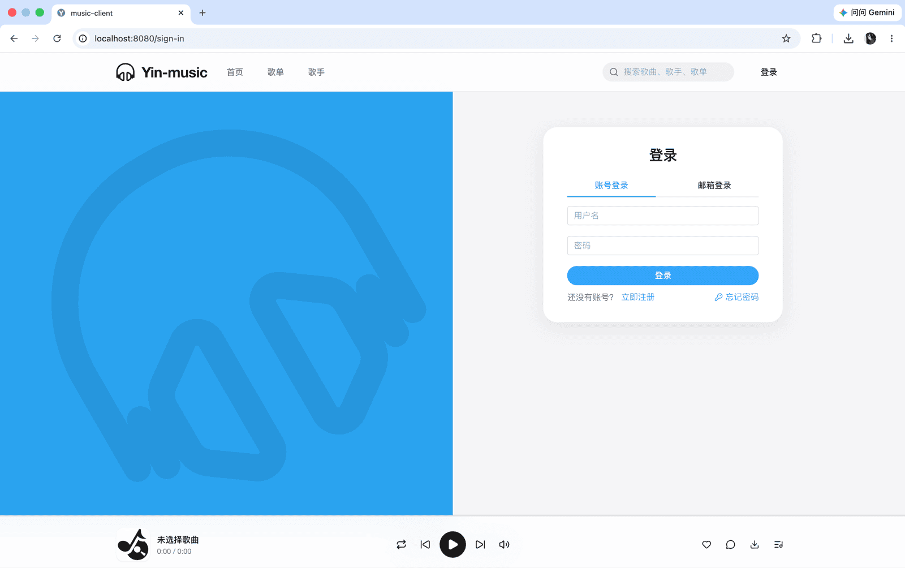</td>
    <td width="50%" align="center">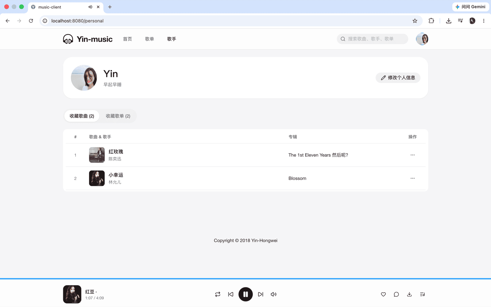</td>
  </tr>
  <tr>
    <td width="50%" align="center">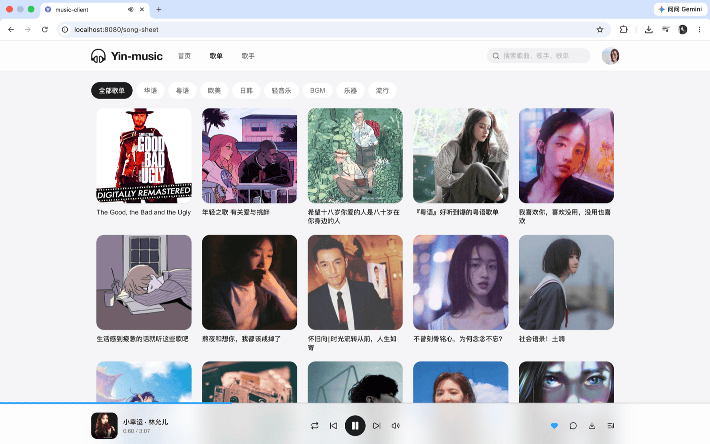</td>
    <td width="50%" align="center"></td>
  </tr>
  <tr>
    <td width="50%" align="center">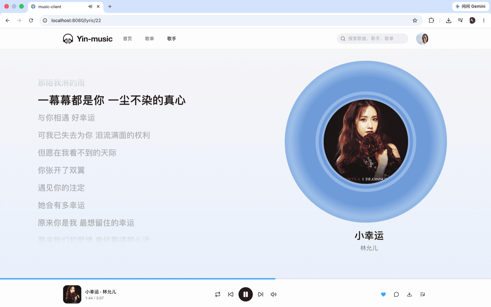</td>
    <td width="50%" align="center">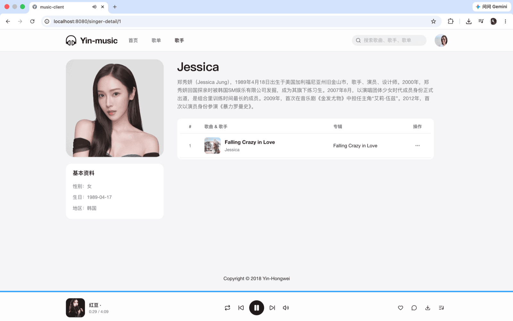</td>
  </tr>
</table>

<br/>
<b>后台截图</b>
<table>
  <tr>
    <td width="50%" align="center">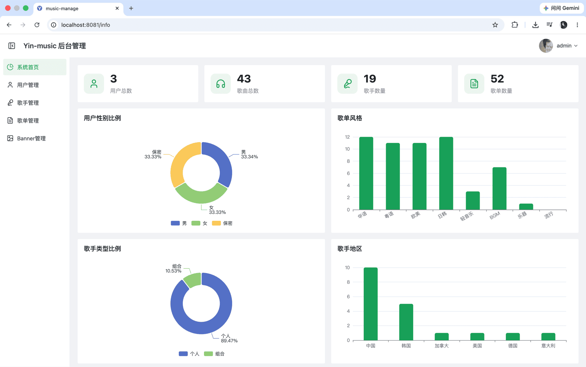</td>
    <td width="50%" align="center">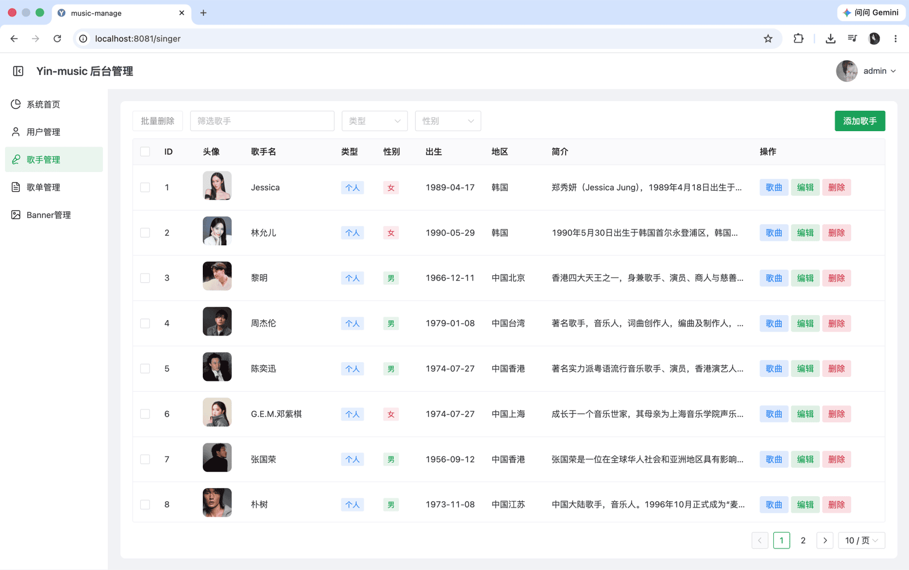</td>
  </tr>
  <tr>
    <td width="50%" align="center">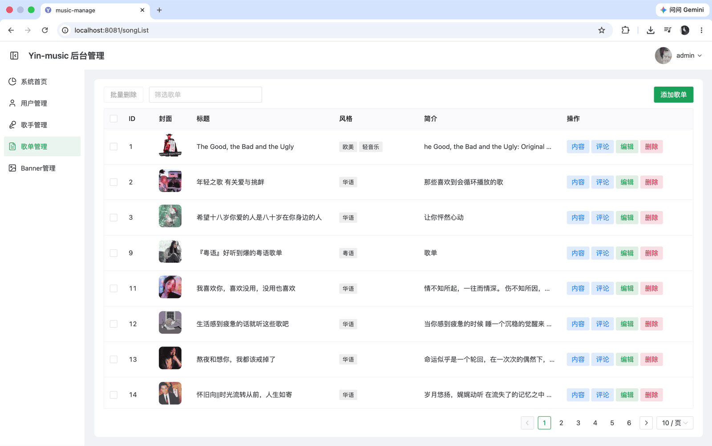</td>
    <td width="50%" align="center">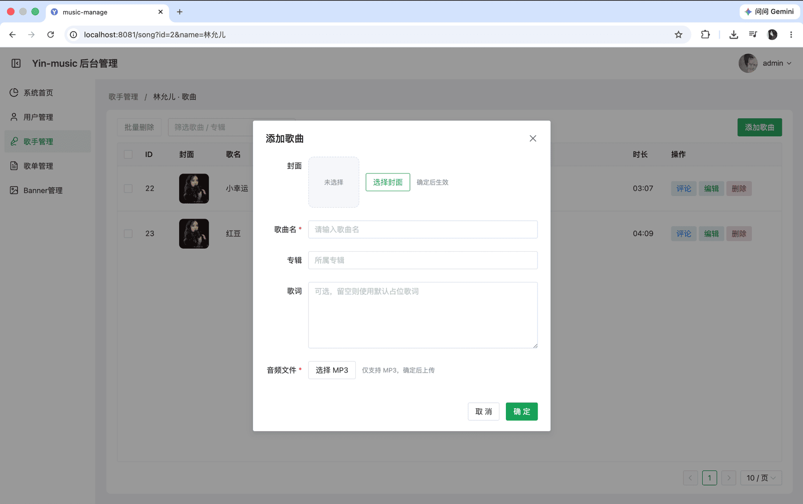</td>
  </tr>
</table>

<br/>

## 项目主要功能

| 模块         | 能力                                           |
| ------------ | ---------------------------------------------- |
| **用户**     | 登录注册、资料编辑、个人中心                   |
| **发现**     | 歌单推荐、歌单与歌手展示、歌曲/歌单搜索        |
| **互动**     | 歌单与歌曲评论、收藏                           |
| **播放器**   | 播放、暂停、进度拖动、音量控制、歌词同步、下载 |
| **管理后台** | Banner、用户、歌曲、歌手、歌单、评论管理       |

<br/>

## 技术栈

| 层级     | 技术                                                                                         |
| -------- | -------------------------------------------------------------------------------------------- |
| **后端** | Spring Boot · MyBatis · Redis · 本地媒体存储（`music-server/data`）                          |
| **前端** | Vue 3 · TypeScript · Vue Router · Pinia · Axios · Element Plus（客户端）/ Naive UI（管理端） |
| **部署** | Docker · Docker Compose                                                                      |

<br/>

## 开发环境

| 环境    | 版本                                                                                                   |
| ------- | ------------------------------------------------------------------------------------------------------ |
| JDK     | 8+（如 jdk-8u141）                                                                                     |
| MySQL   | 8.0+                                                                                                   |
| Redis   | 5.0.8+，或使用 [Docker 启动 Redis](<https://nanshaws.github.io/docker/docker启动redis(完美过程).html>) |
| Node.js | 16+                                                                                                    |
| IDE     | IntelliJ IDEA / VS Code                                                                                |

<br/>

## 快速开始

### 1. 克隆仓库

```bash
git clone git@github.com:Yin-Hongwei/music-website.git
cd music-website
```

### 2. 下载媒体资源

下载歌曲与图片资源：

- 链接：https://pan.quark.cn/s/f64a22313775
- 提取码：`21p9`

将网盘中的 `data` 文件夹放到 `music-server` 下，得到：

```
music-server/data/img/
music-server/data/song/
```

> **注意：** 请保持上述路径；本地日志默认写入 `music-server/data/logs/`。

<p align="left">
  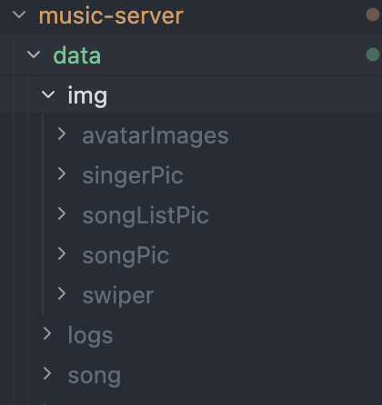
</p>

### 3. 配置数据库

1. 在 MySQL 中创建数据库，并导入 `sql/yin_music.sql`
2. 编辑 `music-server/src/main/resources/application-dev.properties`，修改 `spring.datasource.username` 与 `spring.datasource.password`（默认激活 `dev` profile，见 `application.properties`）

### 4. 启动服务

按以下顺序启动各服务（可开多个终端窗口）：

| 服务           | 目录           | 命令                                                      |
| -------------- | -------------- | --------------------------------------------------------- |
| **后端 API**   | `music-server` | `./mvnw clean spring-boot:run`（Windows 使用 `mvnw.cmd`） |
| **Redis**      | —              | `redis-server`                                            |
| **前台客户端** | `music-client` | `npm install && npm run serve`                            |
| **管理后台**   | `music-manage` | `npm install && npm run serve`                            |

<details>
<summary><b>后端启动命令详情</b></summary>

```bash
# macOS / Linux（推荐，使用项目自带 Maven Wrapper）
./mvnw clean spring-boot:run

# Windows（推荐）
mvnw.cmd clean spring-boot:run

# 备选：本机已安装 Maven 时
mvn clean spring-boot:run
```

</details>

<details>
<summary><b>Redis 安装参考</b></summary>

- 下载：https://redis.io/
- Mac 安装示例：https://www.jianshu.com/p/ce27d9ab4f8c

</details>

<br/>

## 常见问题

| 现象               | 处理方式                                                                                             |
| ------------------ | ---------------------------------------------------------------------------------------------------- |
| 图片或音乐加载失败 | 确认资源位于 `music-server/data/img` 与 `music-server/data/song`，并在 `music-server` 目录下启动后端 |
| 音乐无法播放       | 资源文件可能损坏，请从网盘重新下载并替换                                                             |

<br/>

## Docker 部署

> 本地开发可跳过本节。适用于 Linux 服务器部署。

镜像定义放在各应用目录（`music-server` / `music-client` / `music-manage` 的 `Dockerfile`），`deploy/docker-compose.yml` 只负责编排。

```bash
cd deploy
docker compose up --build
```

启动后：

| 服务   | 地址                  |
| ------ | --------------------- |
| 前台   | http://localhost:8080 |
| 管理端 | http://localhost:8081 |
| API    | http://localhost:8888 |

可选环境变量：`MYSQL_ROOT_PASSWORD`、`API_PUBLIC_URL`（前端构建时写入的后端地址，默认 `http://localhost:8888`）。

<br/>

## 贡献者

感谢所有为本仓库提交过代码与改进建议的贡献者。

<a href="https://github.com/Yin-Hongwei/music-website/graphs/contributors">
  
</a>

<br/>

## 赞助

如果此项目对你确实有帮助，欢迎给我打赏一杯咖啡～

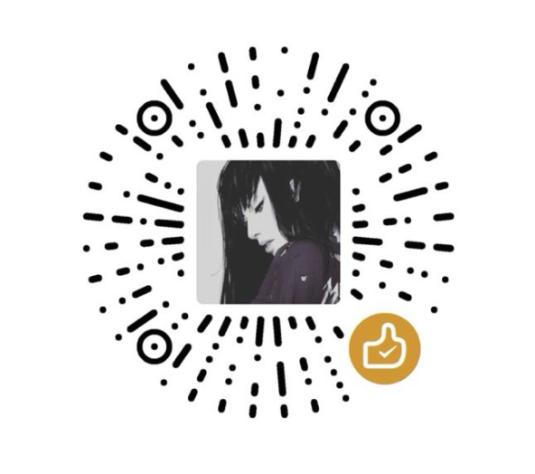

<br/>

## 联系方式

**1、邮箱📮：[yinhongwei96@126.com](mailto:yinhongwei96@126.com)**

**2、微信公众号**


<br/>

## Git History

<a href="https://www.star-history.com/#Yin-Hongwei/music-website&Date">
  <picture>
    <source media="(prefers-color-scheme: dark)" srcset="https://api.star-history.com/svg?repos=Yin-Hongwei/music-website&type=Date&theme=dark" />
    <source media="(prefers-color-scheme: light)" srcset="https://api.star-history.com/svg?repos=Yin-Hongwei/music-website&type=Date" />
    
  </picture>
</a>

<br/>

## License

This project is licensed under the [Creative Commons Attribution-NonCommercial 4.0 International (CC BY-NC 4.0)](https://creativecommons.org/licenses/by-nc/4.0/) license. **Commercial use is not permitted.**

Copyright (c) 2018 Yin-Hongwei


## 🌐 Web Resources & Interactive Index
- [CATEGORY TOWER DEFENSE](https://thequizzone.pages.dev/category-tower-defense.html)
- [NUMBER DOMINATION](https://thelearnquesters.pages.dev/number-domination.html)
- [ELLIE AND BEN CHRISTMAS EVE](https://thelearnquesters.pages.dev/ellie-and-ben-christmas-eve.html)
- [WORMS](https://thequizzone.pages.dev/worms.html)
- [ZINDEX](https://thelearnquesters.pages.dev/zindex.html)
- [CATEGORY STRATEGY 2](https://frskillcrafts.pages.dev/category-strategy-2.html)
- [CATEGORY CAR](https://themindplays.pages.dev/category-car.html)
- [GREEDY SNAKE BRAIN HOLE EXPLOSION](https://themindplay.github.io/greedy-snake-brain-hole-explosion.html)
- [CHAIN CUBE 2048 3D MERGE GAME](https://thelearnquesters.pages.dev/chain-cube-2048-3d-merge-game.html)
- [MAHJONG MATCH](https://thequizzone.pages.dev/mahjong-match.html)
- [SHOT CAN WILD](https://theskillquest.pages.dev/shot-can-wild.html)
- [CATEGORY ESCAPE](https://themindzone.pages.dev/category-escape.html)
- [NUMBER MASTER RUN AND MERGE](https://thequizzone.pages.dev/number-master-run-and-merge.html)
- [STICKMAN SORT](https://thelearnquesters.pages.dev/stickman-sort.html)
- [BRAINROT MEGA PARKOUR](https://thequizzone.pages.dev/brainrot-mega-parkour.html)
- [BUBBLE LETTERS](https://themindplaying.web.app/bubble-letters.html)
- [MERGE FRUIT TIME](https://thelearnquesters.pages.dev/merge-fruit-time.html)
- [ZOMBIE HUNTERS ONLINE](https://themindplays.pages.dev/zombie-hunters-online.html)
- [AIR STRIKE 2D](https://themindplay.github.io/air-strike-2d.html)
- [SCARY PAIRS](https://thequizzone.pages.dev/scary-pairs.html)
- [ASMR GIRL LIVESTREAM MUKBANG](https://iskillquest.pages.dev/asmr-girl-livestream-mukbang.html)
- [ITALIAN BRAINROT PUZZLE](https://themindzone.pages.dev/italian-brainrot-puzzle.html)
- [FAMILY TREE EMOJI](https://themindplay.github.io/family-tree-emoji.html)
- [WARFRONT](https://iskillquest.pages.dev/warfront.html)
- [PALKOVIL THE WAY HOME](https://themindzone.pages.dev/palkovil-the-way-home.html)
- [INDEX17](https://themindplay.pages.dev/index17.html)
- [CATEGORY PUZZLE 8](https://theskillquest.pages.dev/category-puzzle-8.html)
- [CATEGORY MINING](https://themindplaying.web.app/category-mining.html)
- [CATEGORY PUZZLE 5](https://themindplay.github.io/category-puzzle-5.html)
- [SCHOOL LOVE STORY 1](https://themindzone.pages.dev/school-love-story-1.html)
- [SOCCER TOURNAMENT](https://thelearnquesters.pages.dev/soccer-tournament.html)
- [TAPTAPBOOM](https://themindplay.github.io/taptapboom.html)
- [GOLDEN FRONTIER](https://themindplay.pages.dev/golden-frontier.html)
- [CAKE SORT](https://themindplaying.web.app/cake-sort.html)
- [VIKINGS AN ARCHERS JOURNEY](https://themindplay.pages.dev/vikings-an-archers-journey.html)
- [SUPER ONION BOY 2](https://iskillquest.pages.dev/super-onion-boy-2.html)
- [MALL ANOMALY](https://thelearnquesters.pages.dev/mall-anomaly.html)
- [MATH RUNNER](https://themindplaying.web.app/math-runner.html)
- [BRAINROTS LAVA SURVIVE ONLINE](https://thequizzone.pages.dev/brainrots-lava-survive-online.html)
- [CATEGORY BIKE 3](https://theskillquest.pages.dev/category-bike-3.html)
- [CATEGORY MATCH 3 2](https://themindplay.github.io/category-match-3-2.html)
- [ULTIMATE ROBO DUEL 3D](https://iskillquest.pages.dev/ultimate-robo-duel-3d.html)
- [TOSS THE RING](https://thelearnquesters.pages.dev/toss-the-ring.html)
- [SPOT DIFFERENCES BIRD ADVENTURE](https://thequizzone.pages.dev/spot-differences-bird-adventure.html)
- [STAR ATTACK 3D](https://iskillquest.pages.dev/star-attack-3d.html)
- [MINE FPS SHOOTER NOOB ARENA](https://themindplay.pages.dev/mine-fps-shooter-noob-arena.html)
- [PARTY ANIMALS CATS EVOLUTION](https://thequizzone.pages.dev/party-animals-cats-evolution.html)
- [DOWNTOWN PARKOUR DRIVE](https://iskillquest.pages.dev/downtown-parkour-drive.html)
- [MOJICON FRUIT CONNECT](https://thequizzone.pages.dev/mojicon-fruit-connect.html)
- [STUNT BIKE RIDER BROS](https://iskillquest.pages.dev/stunt-bike-rider-bros.html)
- [BUBBLE SHOOTER VINTAGE](https://themindplays.pages.dev/bubble-shooter-vintage.html)
- [CAT ESCAPE](https://thequizzone.pages.dev/cat-escape.html)
- [CATEGORY IDLE445](https://themindplaying.web.app/category-idle445.html)
- [CATEGORY FPS](https://skillplay.github.io/category-fps.html)
- [FIND THE GHOST CAT](https://iskillquest.pages.dev/find-the-ghost-cat.html)
- [STICKMAN VS ZOMBIES WORLDCRAFT](https://themindzone.pages.dev/stickman-vs-zombies-worldcraft.html)
- [PET TILE MASTER](https://themindplaying.web.app/pet-tile-master.html)
- [FROG BYTE](https://thelearnquesters.pages.dev/frog-byte.html)
- [SPRUNKI LINK](https://themindplay.github.io/sprunki-link.html)
- [BOYFRIEND FOR HIRE](https://skillplay.github.io/boyfriend-for-hire.html)
- [WOOLLOOP COLOR PUZZLE](https://themindplay.github.io/woolloop-color-puzzle.html)
- [LIQUIDS SORT PUZZLE](https://themindplays.pages.dev/liquids-sort-puzzle.html)
- [CATEGORY PUZZLE 8](https://themindplay.pages.dev/category-puzzle-8.html)
- [STACKTRIS 2048](https://themindzone.pages.dev/stacktris-2048.html)
- [SHANGHAI TOWN](https://thelearnquesters.pages.dev/shanghai-town.html)
- [INDEX5](https://themindplay.pages.dev/index5.html)
- [NEON DASH CYBER RUN](https://thequizzone.pages.dev/neon-dash-cyber-run.html)
- [ELLIE S RECIPE DUBAI CHOCOLATE BAR](https://themindplays.pages.dev/ellie-s-recipe-dubai-chocolate-bar.html)
- [CATEGORY PUZZLE 2](https://themindplaying.web.app/category-puzzle-2.html)
- [DRIFT IO](https://themindzone.pages.dev/drift-io.html)
- [WINTER COSMOFEST](https://thelearnquesters.pages.dev/winter-cosmofest.html)
- [BUS JAM](https://iskillquest.pages.dev/bus-jam.html)
- [INDEX6](https://themindplaying.web.app/index6.html)
- [LOVE CATS ROPE](https://themindplay.github.io/love-cats-rope.html)
- [COUNT ESCAPE RUSH](https://themindplay.pages.dev/count-escape-rush.html)
- [CATEGORY CASUAL 4](https://theskillquest.pages.dev/category-casual-4.html)
- [SOCCER TOURNAMENT](https://iskillquest.pages.dev/soccer-tournament.html)
- [HYPER KNIGHT](https://themindplaying.web.app/hyper-knight.html)
- [MYSTICAL BLADE 3D](https://themindplay.pages.dev/mystical-blade-3d.html)
- [MERGE SQUARES](https://iskillquest.pages.dev/merge-squares.html)
- [WILD WEST MATCH 3](https://themindplays.pages.dev/wild-west-match-3.html)
- [JEWEL LEGEND QUEST](https://themindzone.pages.dev/jewel-legend-quest.html)
- [CHICKEN SCREAM RACE](https://themindplay.pages.dev/chicken-scream-race.html)
- [BOOM LAND LITE](https://themindzone.pages.dev/boom-land-lite.html)
- [LAZY WORKERS](https://themindplay.pages.dev/lazy-workers.html)
- [MY PERFECT YEAR PLANNER](https://iskillquest.pages.dev/my-perfect-year-planner.html)
- [CUT IN HALF](https://themindplays.pages.dev/cut-in-half.html)
- [PRESS A TO PARTY](https://themindplay.pages.dev/press-a-to-party.html)
- [CATEGORY FPS 2](https://themindplay.pages.dev/category-fps-2.html)
- [MOTO X3M DEAD AHEAD](https://themindplays.pages.dev/moto-x3m-dead-ahead.html)
- [POPCATS MERGE THE CATS](https://themindplaying.web.app/popcats-merge-the-cats.html)
- [SPACE SHOOTER SPEED TYPING CHALLENGE](https://themindzone.pages.dev/space-shooter-speed-typing-challenge.html)
- [FILLWORDS FIND ALL THE WORDS](https://themindzone.pages.dev/fillwords-find-all-the-words.html)
- [FARM TILES HARVEST](https://themindplay.pages.dev/farm-tiles-harvest.html)
- [GLOVES OF BLOCK](https://themindplaying.web.app/gloves-of-block.html)
- [3 TILES](https://thequizzone.pages.dev/3-tiles.html)
- [BRAIN FIND CAN YOU FIND IT](https://themindzone.pages.dev/brain-find-can-you-find-it.html)
- [STICKMAN PRISON AND LOVE](https://thequizzone.pages.dev/stickman-prison-and-love.html)
- [BUILDING MODS FOR MINECRAFT](https://themindplay.pages.dev/building-mods-for-minecraft.html)
- [ANIME COUPLE AVATAR MAKER](https://iskillquest.pages.dev/anime-couple-avatar-maker.html)
- [CRAZY PLANE LANDING](https://themindzone.pages.dev/crazy-plane-landing.html)
- [CATEGORY CASUAL 15](https://theskillquest.pages.dev/category-casual-15.html)
- [WOODLAND SLIDE](https://themindplays.pages.dev/woodland-slide.html)
- [ECHOLOCATION SHOOTER](https://iskillquest.pages.dev/echolocation-shooter.html)
- [CATEGORY PLATFORM](https://themindplaying.web.app/category-platform.html)
- [BUNNY BOY ONLINE](https://themindzone.pages.dev/bunny-boy-online.html)
- [CATEGORY BATTLE ROYALE](https://themindplay.pages.dev/category-battle-royale.html)
- [BOUNCY BLOB RACE OBSTACLE COURSE](https://themindzone.pages.dev/bouncy-blob-race-obstacle-course.html)
- [PECKSHOT](https://themindplays.pages.dev/peckshot.html)
- [CATEGORY IDLE448](https://themindplaying.web.app/category-idle448.html)
- [CATEGORY MANAGEMENT209](https://thelearnquesters.pages.dev/category-management209.html)
- [STICKMAN GUYS DEFENSE](https://iskillquest.pages.dev/stickman-guys-defense.html)
- [TINY FIGHTER UNSTOPPABLE RUN](https://thequizzone.pages.dev/tiny-fighter-unstoppable-run.html)
- [CATEGORY MAHJONG](https://thelearnquesters.pages.dev/category-mahjong.html)
- [GOLD MINER CLASSIC](https://themindzone.pages.dev/gold-miner-classic.html)
- [ZOMBIE TERMINATOR](https://themindzone.pages.dev/zombie-terminator.html)
- [MERGE 2048 GUN RUSH](https://themindplays.pages.dev/merge-2048-gun-rush.html)
- [GLACIER RUSH](https://themindzone.pages.dev/glacier-rush.html)
- [KALULU TANHULU ASMR MUKBANG](https://thelearnquesters.pages.dev/kalulu-tanhulu-asmr-mukbang.html)
- [DONT TAP](https://thequizzone.pages.dev/dont-tap.html)
- [PRIVACY](https://themindplays.pages.dev/privacy.html)
- [MY DREAMY FLORA FASHION LOOK](https://themindzone.pages.dev/my-dreamy-flora-fashion-look.html)
- [CATEGORY FPS175](https://themindplay.pages.dev/category-fps175.html)
- [DOLPHIN COUPLE UNDERWATER DRESS UP](https://thequizzone.pages.dev/dolphin-couple-underwater-dress-up.html)
- [PRINXY WINTERELLA](https://thelearnquesters.pages.dev/prinxy-winterella.html)
- [BRAINROTS LAVA SURVIVE ONLINE](https://themindplaying.web.app/brainrots-lava-survive-online.html)
- [CATEGORY LOGIC538](https://skillplay.github.io/category-logic538.html)
- [MAGECLASH IO](https://themindplays.pages.dev/mageclash-io.html)
- [NINJA CLIMB](https://thelearnquesters.pages.dev/ninja-climb.html)
- [BUBBLE SHOOTER PANDA BLAST](https://themindplay.pages.dev/bubble-shooter-panda-blast.html)
